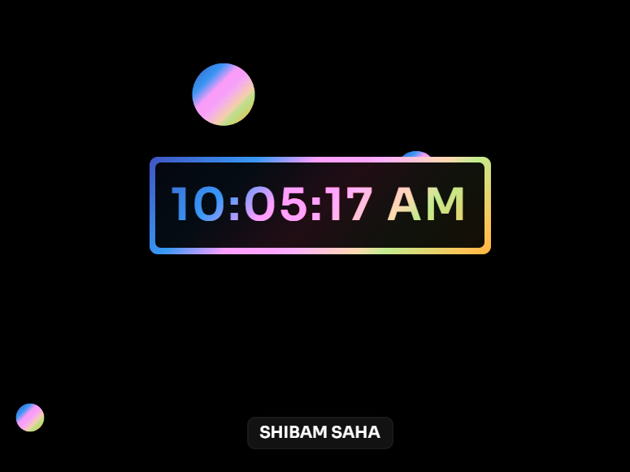

### Digital Clock - Clock with Animated Background

**Details**

- This is a simple responsive Digital Clock Web Application.
- The look & design has been enhanced with a rainbow color changing effect along with an background animation of moving colorful bubbles.

**Tech Stack**

- This Digital Clock Web Application is made with HTML, CSS and Vanilla Javascript only.

**Live Link**

- [Digital Clock Web App](https://s4shibam-digitalclock.netlify.app/)

**Reference Image**

 

**Follow Me**

