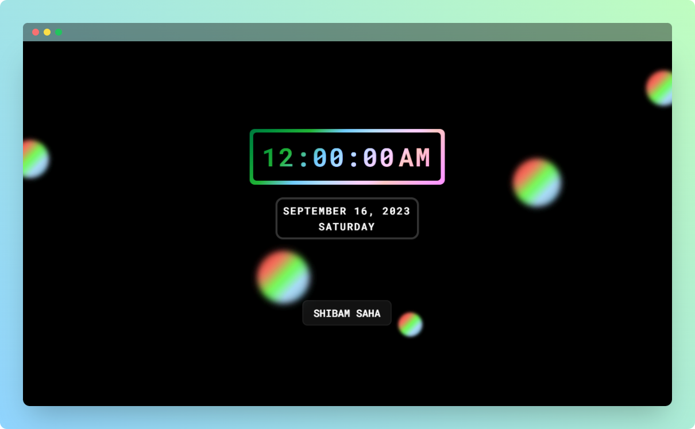

    

    <h1>Digital Clock</h1>
    
Digital Clock

    
    

 

## ⚡ Introduction

This is a simple responsive Digital Clock.  

## ✨ Features
  
- Shows Time
- Shows Date and Day
- Rainbow bubbles background animation
  

## ⚙️ Tech Stack
  
- HTML
- CSS
- JavaScript

## 🎯 Goal

- [x] To learn CSS animations
- [x] To learn basic JavaScript syntax
- [x] To practically implement JavaScript `Date` object

## 🖼️ Screenshot

## 👋🏻 Contact

